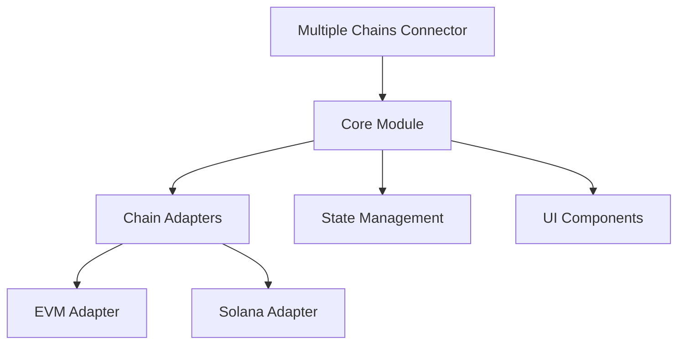

# Multiple Chains Connector - Technical Proposal

## 1. Architecture Overview



## 2. Module Structure

```
📦 multi-chain-connector/
├── src/
│ ├── core/
│ │ ├── types.ts
│ │ └── constants.ts
│ ├── adapters/
│ │ ├── evm/
│ │ │ ├── config.ts
│ │ │ └── connector.ts
│ │ └── solana/
│ │ ├── config.ts
│ │ └── connector.ts
│ ├── store/
│ │ └── useWalletStore.ts
│ ├── components/
│ │ ├── ConnectButton/
│ │ ├── ChainSwitcher/
│ │ ├── ConnectModal/
│ │ └── AccountMenu/
│ └── hooks/
│ ├── useWallet.ts
│ ├── useChain.ts
│ └── useAccount.ts
```

## 3. Core Features Implementation

### 3.1 Enhanced State Management (Zustand)

```typescript
import { create } from 'zustand'
import { persist } from 'zustand/middleware'

interface WalletState {
  // Chain State
  chainType: 'evm' | 'solana'
  chain: any
  availableChains: any[]
  
  // Wallet State
  address: string | null
  isConnected: boolean
  connector: any
  balance: string
  ensName?: string
  
  // UI State
  isModalOpen: boolean
  error: Error | null
  isLoading: boolean
  
  // Actions
  setChain: (chain: any) => void
  setChainType: (type: 'evm' | 'solana') => void
  connect: (connector: any) => Promise<void>
  disconnect: () => void
  updateBalance: () => Promise<void>
  setModalOpen: (isOpen: boolean) => void
  clearError: () => void
}

export const useWalletStore = create<WalletState>()(
  persist(
    (set, get) => ({
      // Enhanced initial state
      chainType: 'evm',
      chain: null,
      availableChains: [],
      address: null,
      isConnected: false,
      connector: null,
      balance: '0',
      isModalOpen: false,
      error: null,
      isLoading: false,
      
      // Enhanced actions
      setChain: (chain) => set({ chain }),
      setChainType: (type) => set({ chainType: type }),
      connect: async (connector) => {
        try {
          set({ isLoading: true, error: null })
          // Implementation
          set({ isLoading: false })
        } catch (error) {
          set({ error: error as Error, isLoading: false })
        }
      },
      disconnect: () => set({
        address: null,
        isConnected: false,
        balance: '0',
        ensName: undefined
      }),
      updateBalance: async () => {
        // Implementation
      },
      setModalOpen: (isOpen) => set({ isModalOpen: isOpen }),
      clearError: () => set({ error: null })
    }),
    {
      name: 'wallet-storage',
      partialize: (state) => ({
        chainType: state.chainType,
        chain: state.chain
      })
    }
  )
)
```

### 3.2 Enhanced Chain Adapter Interface

```typescript
interface ChainConfig {
  id: string | number
  name: string
  nativeCurrency: {
    name: string
    symbol: string
    decimals: number
  }
  rpcUrls: string[]
  blockExplorers?: {
    name: string
    url: string
  }[]
}

interface WalletInfo {
  address: string
  balance: string
  chainId: string | number
  ensName?: string
}

interface ChainAdapter {
  // Connection Methods
  connect: (connector: any) => Promise<WalletInfo>
  disconnect: () => Promise<void>
  switchChain: (chainId: number | string) => Promise<void>
  
  // Account Methods
  getAccount: () => Promise<WalletInfo>
  getBalance: (address: string) => Promise<string>
  signMessage: (message: string) => Promise<string>
  
  // Chain Methods
  addChain: (chain: ChainConfig) => Promise<void>
  getChainId: () => Promise<string | number>
  
  // Utility Methods
  isConnected: () => boolean
  isChainSupported: (chainId: string | number) => boolean
}
```

### 3.3 Enhanced EVM Implementation

```typescript
import { configureChains, createConfig, getAccount, getBalance, signMessage } from 'wagmi'
import { mainnet, polygon, optimism } from 'wagmi/chains'
import { MetaMaskConnector } from 'wagmi/connectors/metaMask'
import { WalletConnectConnector } from 'wagmi/connectors/walletConnect'

export class EVMAdapter implements ChainAdapter {
  private config: any
  private chains: any[]
  
  constructor(chains: any[], connectors: string[]) {
    const { chains: configuredChains, publicClient } = configureChains(chains, [
      publicProvider(),
    ])
    
    this.chains = configuredChains
    this.config = createConfig({
      autoConnect: true,
      connectors: this.getConnectors(connectors),
      publicClient,
    })
  }
  
  private getConnectors(connectorTypes: string[]) {
    return connectorTypes.map(type => {
      switch(type) {
        case 'metamask':
          return new MetaMaskConnector()
        case 'walletconnect':
          return new WalletConnectConnector({
            options: {
              projectId: process.env.NEXT_PUBLIC_WC_PROJECT_ID!
            }
          })
        default:
          throw new Error(`Unsupported connector: ${type}`)
      }
    })
  }
  
  // Implementation of interface methods...
}
```

## 4. Enhanced UI Components

### 4.1 Connect Button with Loading and Error States

```typescript
import { Button, Loader, Tooltip } from '@mantine/core'

export const ConnectButton = () => {
  const { connect, isConnected, address, isLoading, error } = useWalletStore()
  
  if (error) {
    return (
      <Tooltip label={error.message}>
        <Button color="red" onClick={() => connect()}>
          Try Again
        </Button>
      </Tooltip>
    )
  }
  
  return (
    <Button
      onClick={() => !isConnected ? connect() : null}
      disabled={isLoading}
    >
      {isLoading ? (
        <Loader size="sm" />
      ) : isConnected ? (
        shortenAddress(address)
      ) : (
        'Connect Wallet'
      )}
    </Button>
  )
}
```

### 4.2 Chain Switcher Component

```typescript
import { Select, Image } from '@mantine/core'

export const ChainSwitcher = () => {
  const { chain, availableChains, setChain } = useWalletStore()
  
  return (
    <Select
      value={chain?.id}
      onChange={(value) => {
        const newChain = availableChains.find(c => c.id === value)
        setChain(newChain)
      }}
      data={availableChains.map(chain => ({
        value: chain.id,
        label: chain.name,
        icon: <Image src={chain.icon} width={20} height={20} />
      }))}
    />
  )
}
```

## 5. Exported Hooks

```typescript
export const useWallet = () => {
  const store = useWalletStore()
  
  return {
    connect: store.connect,
    disconnect: store.disconnect,
    isConnected: store.isConnected,
    address: store.address,
    chainType: store.chainType
  }
}
```

## 6. Configuration Example

```typescript
import { MultiChainConnector } from 'multi-chain-connector'

const config = {
  evm: {
    chains: [mainnet, polygon],
    connectors: ['metamask', 'walletconnect'],
  },
  solana: {
    networks: ['mainnet-beta', 'devnet'],
    connectors: ['phantom', 'solflare']
  }
}

export const connector = new MultiChainConnector(config)
```

## 7. Key Features

1. **Chain Abstraction Layer**
   - Unified interface for different blockchain types
   - Easy to extend for new chains

2. **State Management**
   - Centralized state using Zustand
   - Persistent storage for user preferences
   - Real-time updates for wallet states

3. **Component Library**
   - Modular UI components built with Mantine
   - Customizable themes and styles
   - Responsive design

4. **Developer Experience**
   - TypeScript support
   - Easy-to-use hooks
   - Comprehensive documentation
   - Plugin system for extensions

## 8. Next Steps

1. Implementation of core modules
2. Development of chain adapters
3. Creation of UI components
4. Testing and documentation
5. Example implementation in Next.js
6. Publishing to npm

## Technologies Used

- [Wagmi](https://wagmi.sh/) - Ethereum React Hooks
- [Zustand](https://zustand.docs.pmnd.rs/) - State Management
- [Mantine UI](https://ui.mantine.dev/) - UI Components
- Next.js - Framework Support

## 9. Security Considerations

1. **Wallet Connection Security**
   - Implement proper error handling for failed connections
   - Validate chain IDs and addresses
   - Secure storage of sensitive data

2. **Transaction Safety**
   - Transaction confirmation modals
   - Gas estimation and validation
   - Clear error messages for failed transactions

3. **Data Privacy**
   - Minimal storage of user data
   - Clear local storage on disconnect
   - Optional analytics with user consent

## 10. Performance Optimization

1. **State Management**
   - Selective persistence of critical data
   - Efficient state updates
   - Memoization of expensive computations

2. **Network Requests**
   - Request caching
   - Rate limiting
   - Fallback RPC providers

3. **UI Optimization**
   - Lazy loading of components
   - Optimized re-renders
   - Skeleton loaders for better UX
