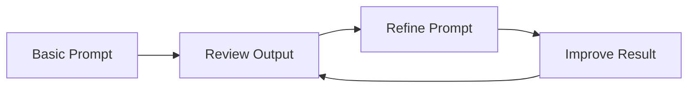

# 🤖 AI Coding Best Practices

A practical guide to effectively using AI for coding.

---

## 📋 Quick Summary

AI coding assistants work best when provided with:

- Clear and specific prompts
- Proper context about your codebase
- Well-defined requirements
- Relevant constraints and dependencies
- Project-specific conventions

---

## 🎯 Providing Context to AI

### 1. Project Context

```markdown
✅ "This is a TypeScript React project using:
    - Next.js 13 with App Router
    - TailwindCSS for styling
    - Jest for testing
    - MSW for API mocking
    - React Query for data fetching"
```

### 2. Code Context

```markdown
✅ "The component needs to:
    - Integrate with our existing authentication system
    - Follow our team's naming conventions
    - Use our shared UI components
    - Match our error handling patterns"
```

### 3. Architecture Context

```markdown
✅ "We follow:
    - Feature-based folder structure
    - Custom hook patterns for logic
    - Redux for global state
    - API service layer abstraction
    - Component composition pattern"
```

### 4. Dependencies Context

```markdown
✅ "The project uses:
    - Node.js v18
    - React v18.2
    - TypeScript v5.0
    - Package manager: pnpm
    - Build tool: Vite"
```

### 5. Performance Requirements

```markdown
✅ "The code should:
    - Support server-side rendering
    - Be bundle-size conscious
    - Handle large data sets
    - Support mobile devices"
```

---

## 📝 Writing Effective Prompts

The key to getting the best results from AI coding assistants lies in how you formulate your prompts.

### ✨ Best Practices

1. **Be Specific and Clear**

   ```markdown
   ✅ "Create a TypeScript function that validates email addresses with RFC 5322 standards"
   ❌ "Make an email validator"
   ```

2. **Provide Context**

   ```markdown
   ✅ "This is a Next.js 13 project using App Router. Create a loading.tsx component that shows a skeleton UI"
   ❌ "Make a loading component"
   ```

3. **Include Requirements**

   ```markdown
   ✅ "The function should:
       - Handle null/undefined inputs
       - Throw custom error messages
       - Be unit tested
       - Use TypeScript strict mode"
   ```

4. **Specify Constraints**

   ```markdown
   ✅ "Optimize this sort function for:
       - Memory efficiency
       - Arrays < 1000 elements
       - Numbers only
       - No external libraries"
   ```

### 🎯 Example Prompts by Task

#### 1. Code Generation

```markdown
✅ "Create a React custom hook for handling form validation with:
    - Email, password, and phone number fields
    - Real-time validation
    - Error message handling
    - TypeScript types
    - Usage example"
```

#### 2. Code Refactoring

```markdown
✅ "Refactor this function to:
    - Use modern ES6+ features
    - Improve error handling
    - Add type safety
    - Enhance performance
    - Include comments explaining changes"
```

#### 3. Bug Fixing

```markdown
✅ "Debug this authentication flow:
    - Check for token expiration
    - Validate refresh token
    - Handle network errors
    - Add logging for issues"
```

---

## 🔄 Context-Aware Examples

### 1. Component Creation

```markdown
✅ "Create a DataTable component that:
    Context:
    - Uses our existing design system
    - Follows our accessibility patterns
    - Integrates with our analytics system
    
    Requirements:
    - Sortable columns
    - Pagination
    - Row selection
    - Custom cell rendering
    
    Technical Context:
    - TypeScript strict mode
    - Styled with TailwindCSS
    - Uses React Query for data fetching
    - Supports SSR"
```

### 2. API Integration

```markdown
✅ "Add an API endpoint that:
    Context:
    - Uses our Express.js backend
    - Follows our REST API conventions
    - Uses our error handling middleware
    
    Requirements:
    - JWT authentication
    - Rate limiting
    - Request validation
    - Response caching
    
    Technical Context:
    - TypeScript
    - MongoDB with Mongoose
    - Express.js middleware pattern
    - OpenAPI documentation"
```

### 3. State Management

```markdown
✅ "Implement global state for:
    Context:
    - Uses Redux Toolkit
    - Follows our store structure
    - Integrates with existing slices
    
    Requirements:
    - User preferences
    - Theme settings
    - Language selection
    
    Technical Context:
    - TypeScript
    - Redux Toolkit Query
    - Persisted state
    - Dev tools support"
```

---

## 🎓 Context Best Practices

1. **Code Style Context**

   ```markdown
   ✅ "Our code style includes:
       - Functional components
       - Custom hooks for logic
       - Props interfaces
       - JSDoc comments
       - Unit test patterns"
   ```

2. **Business Logic Context**

   ```markdown
   ✅ "The feature should:
       - Handle user roles (Admin, User, Guest)
       - Support multi-language
       - Follow GDPR requirements
       - Log user actions
       - Support offline mode"
   ```

3. **Testing Context**

   ```markdown
   ✅ "Tests should follow:
       - Jest + React Testing Library
       - Component isolation
       - Mock service worker
       - E2E with Cypress
       - Coverage requirements"
   ```

---

## 💡 Best Working Practices

### 1. Iterative Development



1. Start Simple
   - Begin with core functionality
   - Add features incrementally
   - Build on working code

2. Review & Refine
   - Check generated code
   - Test edge cases
   - Improve gradually

### 2. Code Quality Control

#### Always Verify

- ✅ Code functionality
- ✅ Error handling
- ✅ Edge cases
- ✅ Performance
- ✅ Security implications

#### Security Checklist

- 🔒 No hardcoded credentials
- 🔒 Input validation
- 🔒 Secure dependencies
- 🔒 Error message safety
- 🔒 Access control

---

## 🚀 Quick Reference

### Do's and Don'ts

| Do ✅ | Don't ❌ |
|-------|----------|
| Specify programming language | Assume AI knows context |
| Include version requirements | Skip error handling |
| Mention framework constraints | Accept code without review |
| Ask for examples | Share sensitive data |
| Request explanations | Use vague descriptions |

### Common Patterns

#### 1. Documentation Requests

```markdown
"Document this function including:
- Purpose
- Parameters
- Return values
- Examples
- Error cases"
```

#### 2. Testing Requests

```markdown
"Generate unit tests for this function covering:
- Happy path
- Edge cases
- Error scenarios
- Input validation"
```

#### 3. Performance Optimization

```markdown
"Optimize this code for:
- Time complexity
- Memory usage
- Resource efficiency
- Scalability"
```

---

## 🎓 Tips for Success

1. **Start Each Session Right**
   - Clear problem definition
   - Known constraints
   - Expected outcomes
   - Success criteria

2. **Maintain Context**
   - Reference relevant code
   - Explain dependencies
   - Mention technical limitations
   - Describe environment

3. **Iterative Improvement**
   - Review generated code
   - Test thoroughly
   - Refine requirements
   - Document changes

---

## 🔍 Quality Checklist

Before accepting AI-generated code:

```markdown
□ Code follows project style guide
□ All edge cases are handled
□ Error handling is implemented
□ Documentation is complete
□ Tests are included
□ Performance is acceptable
□ Security best practices followed
□ No unnecessary dependencies
□ Code is maintainable
□ Follows SOLID principles
```

---

Remember: AI is a powerful tool, but it's most effective when guided by human expertise and best practices. Always review, test, and validate generated code before using it in production.
