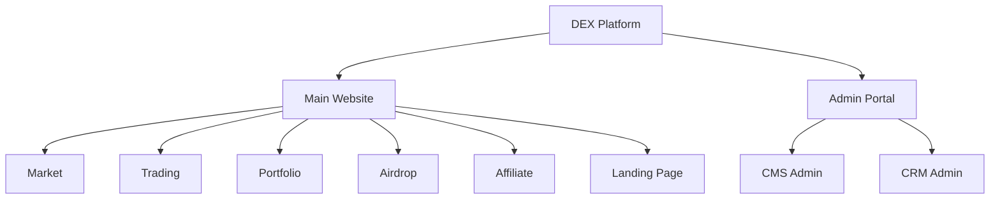
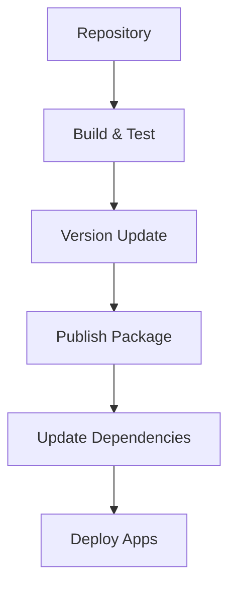

# 🏗️ DEX Platform Architecture Proposal

> A comprehensive architecture design for a modular DEX platform using Next.js with individual repositories

## 📚 Table of Contents

1. [Project Overview](#project-overview)
2. [Repository Structure](#repository-structure)
3. [Package Management](#package-management)
4. [Technical Stack](#technical-stack)
5. [Module Architecture](#module-architecture)
6. [Shared Components](#shared-components)
7. [Development Guidelines](#development-guidelines)
8. [Deployment Strategy](#deployment-strategy)

---

## 🎯 Project Overview

### Applications Structure



### Key Features

- Unified Web3 connectivity across all applications
- Shared UI components and styling through NPM packages
- Consistent chain configuration
- Centralized state management for blockchain interactions
- Independent deployment and versioning

---

## 🏛️ Repository Structure

### Individual Repositories

```markdown
🏢 DEX Organization
 ┣ 📂 Applications
 ┃ ┣ 📦 dex-main-site          # Main DEX website repository
 ┃ ┣ 📦 dex-cms-admin          # CMS Admin repository
 ┃ ┗ 📦 dex-crm-admin          # CRM Admin repository
 ┣ 📂 Packages
 ┃ ┣ 📦 @dex/web3-sdk         # Web3 connectivity package
 ┃ ┣ 📦 @dex/ui-kit           # UI components package
 ┃ ┣ 📦 @dex/core-sdk         # Core business logic package
 ┃ ┣ 📦 @dex/config           # Configuration package
 ┃ ┗ 📦 @dex/utils            # Utilities package
```

### Repository Template Structure

```markdown
📦 dex-main-site
 ┣ 📂 src
 ┃ ┣ 📂 app                   # Next.js app directory
 ┃ ┣ 📂 components           # Local components
 ┃ ┣ 📂 features            # Feature modules
 ┃ ┣ 📂 hooks               # Custom hooks
 ┃ ┣ 📂 services           # API services
 ┃ ┣ 📂 styles             # Global styles
 ┃ ┗ 📂 utils              # Local utilities
 ┣ 📜 package.json
 ┣ 📜 tsconfig.json
 ┗ 📜 README.md
```

---

## 📦 Package Management

### 1. Package Publishing Strategy

```typescript
// package.json for @dex/web3-sdk
{
  "name": "@dex/web3-sdk",
  "version": "1.0.0",
  "private": false,
  "main": "dist/index.js",
  "module": "dist/index.mjs",
  "types": "dist/index.d.ts",
  "files": [
    "dist"
  ],
  "scripts": {
    "build": "tsup src/index.ts --format cjs,esm --dts",
    "publish-package": "npm publish --access public"
  }
}
```

### 2. Version Management

```markdown
# Version Control Strategy

1. Semantic Versioning
   - Major: Breaking changes (x.0.0)
   - Minor: New features (0.x.0)
   - Patch: Bug fixes (0.0.x)

2. Package Dependencies
   - Use fixed versions for stability
   - Regular dependency updates
   - Automated security updates
```

### 3. Package Integration

```typescript
// Example: Installing and using packages in applications
{
  "dependencies": {
    "@dex/web3-sdk": "^1.0.0",
    "@dex/ui-kit": "^1.0.0",
    "@dex/core-sdk": "^1.0.0",
    "@dex/config": "^1.0.0",
    "@dex/utils": "^1.0.0"
  }
}
```

---

## 🔄 Shared Package Details

### 1. @dex/web3-sdk

```typescript
// Web3 SDK Structure
📦 @dex/web3-sdk
 ┣ 📂 src
 ┃ ┣ 📂 connectors          # Wallet connectors
 ┃ ┣ 📂 contracts          # Contract interactions
 ┃ ┣ 📂 providers          # Web3 providers
 ┃ ┗ 📂 hooks             # Web3 hooks
 ┣ 📜 package.json
 ┗ 📜 README.md

// Example Usage
import { useWeb3Connection } from '@dex/web3-sdk';

const { connect, disconnect, account } = useWeb3Connection();
```

### 2. @dex/ui-kit

```typescript
// UI Kit Structure
📦 @dex/ui-kit
 ┣ 📂 src
 ┃ ┣ 📂 components         # UI components
 ┃ ┣ 📂 hooks             # UI hooks
 ┃ ┣ 📂 styles            # Theme and styles
 ┃ ┗ 📂 utils             # UI utilities
 ┣ 📜 package.json
 ┗ 📜 README.md

// Example Usage
import { Button, TokenSelector } from '@dex/ui-kit';
```

### 3. @dex/core-sdk

```typescript
// Core SDK Structure
📦 @dex/core-sdk
 ┣ 📂 src
 ┃ ┣ 📂 services          # Core services
 ┃ ┣ 📂 types             # Type definitions
 ┃ ┣ 📂 constants         # Constants
 ┃ ┗ 📂 utils             # Core utilities
 ┣ 📜 package.json
 ┗ 📜 README.md

// Example Usage
import { TradeService } from '@dex/core-sdk';
```

---

## 📝 Development Guidelines

### 1. Package Development Workflow

```markdown
1. Local Development
   - Use npm link for local testing
   - Implement proper testing
   - Maintain documentation

2. Release Process
   - Update CHANGELOG.md
   - Run tests
   - Build package
   - Publish to NPM
   - Tag release in Git
```

### 2. Repository Standards

```markdown
1. Repository Setup
   - Consistent README structure
   - Standard issue templates
   - PR templates
   - GitHub Actions workflows

2. Code Standards
   - ESLint configuration
   - Prettier setup
   - Husky pre-commit hooks
   - Conventional commits
```

---

## 🚀 Deployment Strategy

### 1. Independent Deployments



### 2. CI/CD Configuration

```yaml
# Example GitHub Actions workflow
name: Package Release
on:
  push:
    tags:
      - 'v*'
jobs:
  build:
    runs-on: ubuntu-latest
    steps:
      - uses: actions/checkout@v2
      - uses: actions/setup-node@v2
      - run: npm ci
      - run: npm test
      - run: npm run build
      - run: npm publish
```

---

## 🔄 Package Update Process

### 1. Update Strategy

```markdown
1. Regular Updates
   - Weekly dependency checks
   - Monthly minor updates
   - Quarterly major version reviews

2. Breaking Changes
   - RFC process for major changes
   - Migration guides
   - Deprecation notices
```

### 2. Version Control

```markdown
1. Git Flow
   - main: production-ready code
   - develop: integration branch
   - feature/*: new features
   - hotfix/*: emergency fixes

2. Release Process
   - Version bump
   - Changelog update
   - Tag creation
   - Package publication
```

---

## 🔒 Security Considerations

### 1. Package Security

- Regular dependency audits
- Automated vulnerability scanning
- Access token management
- Package signing

### 2. Repository Security

- Branch protection rules
- Required reviews
- Automated security checks
- Secret management

---

Remember: While individual repositories provide more flexibility and independence, maintaining consistency across packages and applications is crucial. Regular communication and documentation updates are essential for successful package management.
