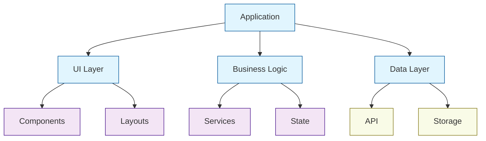
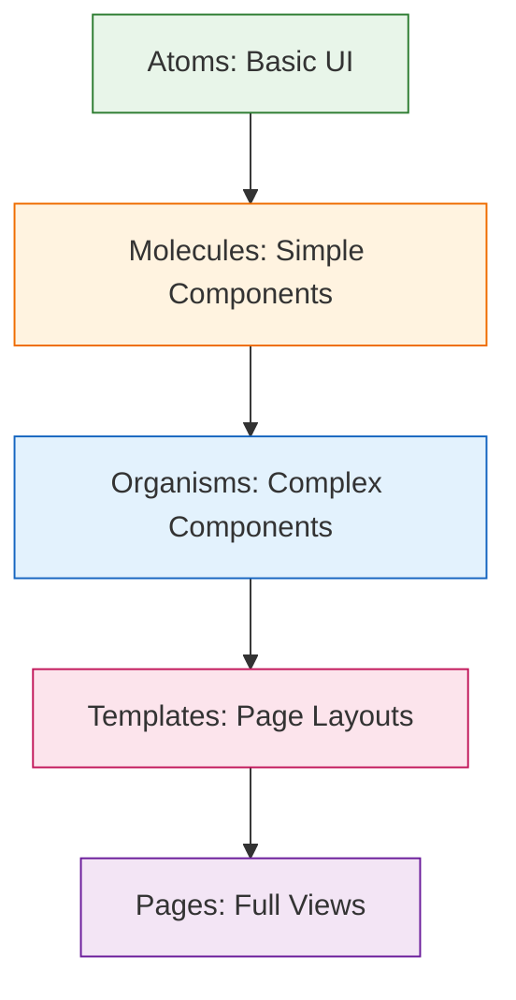
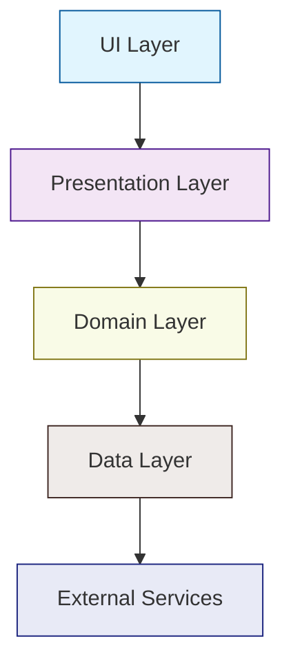
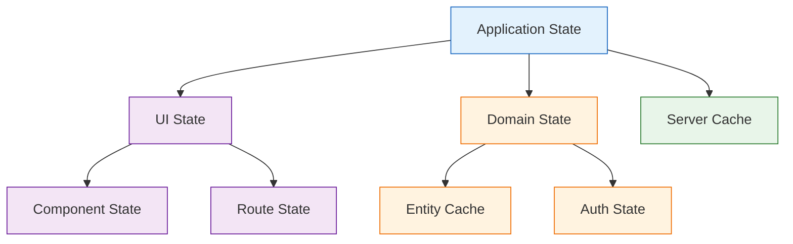
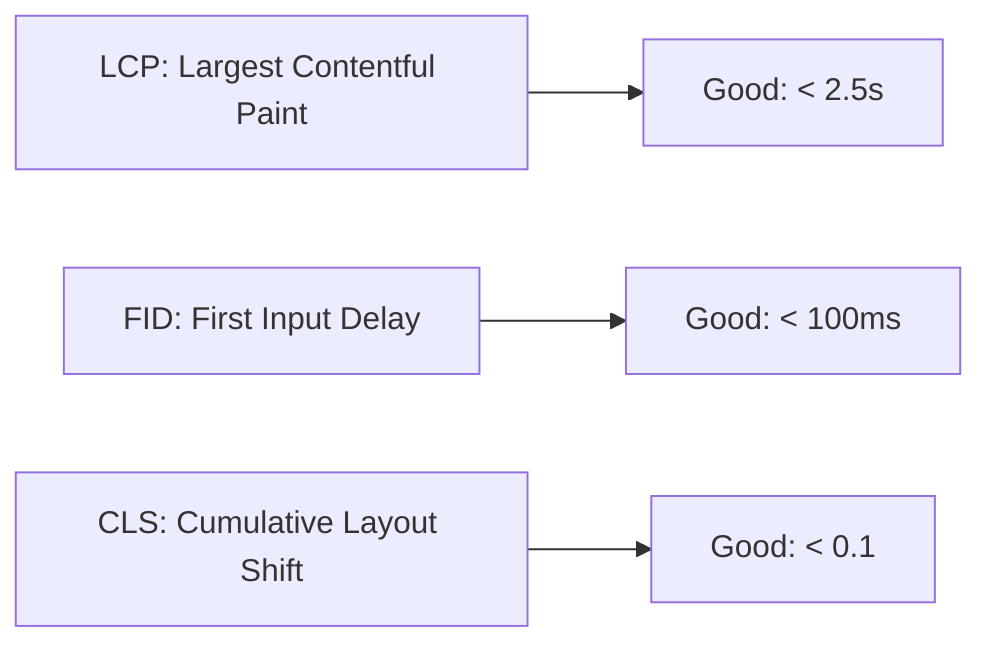
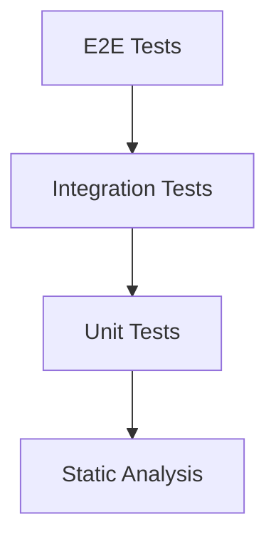

# 🏗️ Modern Frontend Architecture Guide

> Building scalable, maintainable, and efficient web applications with best practices and proven patterns.

---

## 📚 Table of Contents

1. [Overview](#overview)
2. [Core Principles](#core-principles)
3. [Architecture Patterns](#architecture-patterns)
4. [Project Organization](#project-organization)
5. [State Management](#state-management)
6. [Performance](#performance)
7. [Testing & Quality](#testing--quality)
8. [Security & Best Practices](#security--best-practices)
9. [Deployment & CI/CD](#deployment--cicd)
10. [Monitoring & Analytics](#monitoring--analytics)
11. [Case Studies](#case-studies)
12. [Tools & Resources](#tools--resources)

---

## 💫 Overview

### What is Frontend Architecture?

Frontend architecture is the structural foundation of web applications, encompassing:

- **Code Organization and Patterns**
  - Structured approach to organizing code
  - Consistent naming conventions
  - Design patterns implementation
  - Module organization

- **Performance Optimization Strategies**
  - Load time optimization
  - Runtime performance
  - Memory management
  - Resource optimization

- **Development Workflows**
  - Git workflow
  - Code review process
  - CI/CD pipelines
  - Development environment setup

- **Quality Assurance Practices**
  - Testing strategies
  - Code quality tools
  - Performance monitoring
  - Error tracking

- **Team Collaboration Approaches**
  - Documentation standards
  - Code sharing practices
  - Component libraries
  - Knowledge sharing

### Why It Matters

1. **Scalability**
   - **Handle Growing Complexity**
     - Modular architecture
     - Clear boundaries
     - Extensible patterns
     - Future-proof design

   - **Support Multiple Teams**
     - Clear ownership
     - Independent development
     - Shared standards
     - Conflict prevention

   - **Manage Large Codebases**
     - Organized structure
     - Clear dependencies
     - Maintainable patterns
     - Version control strategies

   - **Enable Feature Expansion**
     - Plugin architecture
     - Feature flags
     - A/B testing support
     - Backward compatibility

2. **Maintainability**
   - **Reduce Technical Debt**
     - Clean code practices
     - Regular refactoring
     - Documentation
     - Code reviews

   - **Simplify Updates**
     - Modular components
     - Clear dependencies
     - Version management
     - Update strategies

   - **Enable Quick Fixes**
     - Clear error tracking
     - Fast deployment
     - Rollback capabilities
     - Hot fixes

   - **Improve Code Readability**
     - Consistent styling
     - Clear naming
     - Documentation
     - Code organization

3. **Performance**
   - **Optimize Load Times**
     - Code splitting
     - Lazy loading
     - Resource optimization
     - Caching strategies

   - **Enhance User Experience**
     - Fast interactions
     - Smooth animations
     - Responsive design
     - Offline support

   - **Reduce Resource Usage**
     - Memory optimization
     - CPU efficiency
     - Network optimization
     - Battery consideration

   - **Improve SEO Rankings**
     - Fast load times
     - Core Web Vitals
     - Semantic HTML
     - Accessibility

4. **Team Efficiency**
   - **Clear Development Patterns**
     - Standard practices
     - Common patterns
     - Shared libraries
     - Best practices

   - **Consistent Coding Standards**
     - Style guides
     - Linting rules
     - Type checking
     - Code formatting

   - **Efficient Collaboration**
     - Clear communication
     - Shared knowledge
     - Code reviews
     - Pair programming

   - **Reduced Onboarding Time**
     - Clear documentation
     - Standard practices
     - Training materials
     - Mentoring support

---

## 🏛️ Core Principles

### 1. Separation of Concerns (SoC)

The SoC principle divides the application into distinct sections, each handling specific functionality:



**Layer Responsibilities:**

1. **UI Layer (Presentation)**
   - User interface components
   - Layout management
   - Style definitions
   - User interactions
   - Accessibility
   - Responsive design

2. **Business Logic**
   - Application rules
   - Data transformation
   - State management
   - Validation logic
   - Error handling
   - Feature implementation

3. **Data Layer**
   - API communication
   - Data persistence
   - Caching strategies
   - Data formatting
   - Error handling
   - Offline support

### 2. Component Architecture

The Atomic Design Methodology breaks down interfaces into fundamental building blocks:



**Component Hierarchy:**

1. **Atoms**
   - Basic HTML elements
   - Buttons, inputs, labels
   - Icons, badges
   - Typography elements
   - Single-purpose styles
   - No business logic

2. **Molecules**
   - Simple combinations of atoms
   - Form groups
   - Navigation items
   - Card components
   - Simple interactions
   - Reusable patterns

3. **Organisms**
   - Complex UI components
   - Forms with validation
   - Navigation bars
   - Product cards
   - Data tables
   - Business logic integration

4. **Templates**
   - Page layouts
   - Component placement
   - Grid systems
   - Responsive patterns
   - Content structure
   - Layout variations

5. **Pages**
   - Complete views
   - Real content
   - State management
   - Route handling
   - Data fetching
   - User interactions

### 3. Project Structure

Modern frontend projects follow a structured organization:

```markdown
📦 modern-frontend
 ┣ 📂 src                  # Source code
 ┃ ┣ 📂 core              # Core application code
 ┃ ┃ ┣ 📂 config          # Configuration files
 ┃ ┃ ┣ 📂 types          # TypeScript types/interfaces
 ┃ ┃ ┗ 📂 constants      # Constants and enums
 ┃ ┣ 📂 components       # Shared components
 ┃ ┃ ┣ 📂 atoms          # Basic UI elements
 ┃ ┃ ┣ 📂 molecules      # Simple components
 ┃ ┃ ┗ 📂 organisms      # Complex components
 ┃ ┣ 📂 features         # Feature modules
 ┃ ┃ ┣ 📂 auth           # Authentication feature
 ┃ ┃ ┣ 📂 dashboard      # Dashboard feature
 ┃ ┃ ┗ 📂 settings       # Settings feature
 ┃ ┣ 📂 layouts          # Layout components
 ┃ ┣ 📂 pages            # Page components
 ┃ ┣ 📂 services         # API services
 ┃ ┣ 📂 store            # State management
 ┃ ┣ 📂 styles           # Global styles
 ┃ ┗ 📂 utils            # Utility functions
 ┣ 📂 public             # Public assets
 ┣ 📂 tests              # Test files
 ┗ 📂 docs               # Documentation
```

**Directory Purposes:**

1. **Source (src/)**
   - Main application code
   - Organized by feature and type
   - Clear separation of concerns
   - Modular structure

2. **Core (/core)**
   - Essential application code
   - Configuration management
   - Type definitions
   - Constants and enums
   - Core utilities

3. **Components (/components)**
   - Reusable UI components
   - Atomic design structure
   - Component documentation
   - Style definitions
   - Unit tests

4. **Features (/features)**
   - Feature-based modules
   - Self-contained code
   - Feature-specific components
   - Feature routing
   - Feature state

5. **Services (/services)**
   - API communication
   - External integrations
   - Service workers
   - WebSocket handlers
   - Data transformers

---

## 🏭 Architecture Patterns

Modern frontend applications employ several architectural patterns to maintain scalability and maintainability:

### 1. Component-Based Architecture

Component-based architecture breaks down the UI into reusable, self-contained pieces. Here's a comprehensive example:

```typescript
// Example: Well-structured React component with TypeScript
interface ButtonProps {
  variant: 'primary' | 'secondary' | 'tertiary';
  size: 'sm' | 'md' | 'lg' | 'xl';
  label: string;
  icon?: React.ReactNode;
  isLoading?: boolean;
  disabled?: boolean;
  onClick: () => void;
}

const Button: React.FC<ButtonProps> = ({
  variant,
  size,
  label,
  icon,
  isLoading,
  disabled,
  onClick
}) => {
  const buttonClasses = useButtonStyles({ variant, size });
  
  return (
    <button
      className={buttonClasses}
      onClick={onClick}
      disabled={disabled || isLoading}
      aria-busy={isLoading}
    >
      {isLoading ? <Spinner /> : icon}
      <span className="button-label">{label}</span>
    </button>
  );
};
```

**Key Aspects:**

1. **Props Interface**
   - Clear type definitions
   - Optional and required props
   - Specific value constraints
   - Documentation comments

2. **Component Structure**
   - Functional components
   - TypeScript integration
   - Props destructuring
   - Logical organization

3. **Accessibility**
   - ARIA attributes
   - Semantic HTML
   - Keyboard navigation
   - Screen reader support

4. **State Management**
   - Local state hooks
   - Custom hooks
   - Props handling
   - Event handlers

### 2. Feature-First Architecture

Feature-first architecture organizes code by business features rather than technical types:

```markdown
📦 feature
 ┣ 📂 components          # Feature-specific components
 ┃ ┣ 📜 FeatureComponent.tsx
 ┃ ┗ 📜 SubComponent.tsx
 ┣ 📂 hooks              # Custom hooks for feature
 ┃ ┗ 📜 useFeature.ts
 ┣ 📂 services           # API and business services
 ┃ ┗ 📜 featureAPI.ts
 ┣ 📂 store              # State management
 ┃ ┗ 📜 featureSlice.ts
 ┣ 📂 types              # TypeScript definitions
 ┃ ┗ 📜 types.ts
 ┗ 📜 index.ts           # Public API
```

**Benefits:**

1. **Modularity**
   - Self-contained features
   - Clear boundaries
   - Independent deployment
   - Easy maintenance

2. **Team Organization**
   - Clear ownership
   - Parallel development
   - Reduced conflicts
   - Better collaboration

3. **Scalability**
   - Easy to add features
   - Simple to remove features
   - Clear dependencies
   - Version control

4. **Testing**
   - Isolated testing
   - Clear test boundaries
   - Feature-specific mocks
   - Integration testing

### 3. Clean Architecture

Clean Architecture separates concerns into distinct layers:



**Layer Responsibilities:**

1. **UI Layer**
   - Components
   - Layouts
   - Styles
   - User interactions
   - View logic
   - Event handling

2. **Presentation Layer**
   - View models
   - State management
   - UI logic
   - Data formatting
   - User input processing
   - Navigation

3. **Domain Layer**
   - Business logic
   - Entity models
   - Use cases
   - Domain services
   - Validation rules
   - Business rules

4. **Data Layer**
   - API clients
   - Data persistence
   - Caching
   - Data mapping
   - Storage
   - External services

5. **External Services**
   - APIs
   - Databases
   - Third-party services
   - External systems
   - Integration points

## 💾 State Management

Modern frontend applications require sophisticated state management strategies:

### 1. State Categories



**State Types:**

1. **UI State**
   - Form inputs
   - Modal states
   - Loading states
   - Error messages
   - UI preferences
   - Theme settings

2. **Domain State**
   - Business data
   - Entity relationships
   - Application rules
   - User permissions
   - Feature flags
   - Business logic state

3. **Server Cache**
   - API responses
   - Data freshness
   - Loading states
   - Error states
   - Pagination
   - Optimistic updates

### 2. Implementation Patterns

```typescript
// Local State Management
const [state, setState] = useState<State>(initialState);

// Global State Management (Redux Toolkit)
const slice = createSlice({
  name: 'feature',
  initialState,
  reducers: {
    action: (state, action: PayloadAction<Data>) => {
      // Immutable updates using Immer
    }
  }
});

// Server State Management (React Query)
const { data, isLoading, error } = useQuery({
  queryKey: ['key'],
  queryFn: fetchData,
  staleTime: 5 * 60 * 1000,  // 5 minutes
  cacheTime: 30 * 60 * 1000  // 30 minutes
});
```

**State Management Strategies:**

1. **Local State**
   - Component-specific data
   - Form state
   - UI interactions
   - Temporary data
   - Animation states
   - Local preferences

2. **Global State**
   - User session
   - App configuration
   - Shared data
   - Theme settings
   - Feature flags
   - Global preferences

3. **Server State**
   - API data
   - Cache management
   - Real-time updates
   - Optimistic updates
   - Error handling
   - Loading states

---

## ⚡ Performance

### 1. Core Web Vitals



### 2. Optimization Techniques

```typescript
// Code Splitting
const LazyComponent = lazy(() => import('./Component'));

// Component Memoization
const MemoizedComponent = memo(Component, arePropsEqual);

// Performance Hooks
const memoizedValue = useMemo(() => computeValue(deps), [deps]);
const memoizedCallback = useCallback(() => handler(deps), [deps]);

// Virtual Lists
const VirtualList = ({ items }: Props) => (
  <VirtualScroll
    height={800}
    itemCount={items.length}
    itemSize={50}
  >
    {({ index, style }) => (
      <ListItem 
        item={items[index]}
        style={style}
      />
    )}
  </VirtualScroll>
);
```

---

## 🧪 Testing Strategy

### 1. Testing Pyramid



### 2. Testing Examples

```typescript
// Component Testing
describe('Button', () => {
  it('handles click events', () => {
    const onClickMock = jest.fn();
    render(<Button onClick={onClickMock} />);
    userEvent.click(screen.getByRole('button'));
    expect(onClickMock).toHaveBeenCalled();
  });
});

// Integration Testing
test('authentication flow', async () => {
  render(<AuthFlow />);
  await userEvent.type(screen.getByLabelText(/email/i), 'user@example.com');
  await userEvent.type(screen.getByLabelText(/password/i), 'password');
  await userEvent.click(screen.getByRole('button', { name: /login/i }));
  expect(await screen.findByText(/welcome/i)).toBeInTheDocument();
});
```

---

## 🔒 Security & Best Practices

### 1. Security Checklist

```markdown
✅ XSS Prevention
  □ Sanitize user inputs
  □ Use Content Security Policy
  □ Implement proper escaping

✅ Authentication
  □ Secure session management
  □ Implement proper JWT handling
  □ Use HTTP-only cookies

✅ Data Protection
  □ Encrypt sensitive data
  □ Implement proper CORS
  □ Use HTTPS only
```

### 2. Code Quality Standards

```markdown
✅ Code Style
  □ ESLint configuration
  □ Prettier setup
  □ TypeScript strict mode

✅ Documentation
  □ JSDoc comments
  □ README files
  □ Architecture decisions

✅ Review Process
  □ Code review guidelines
  □ PR templates
  □ Automated checks
```

---

## 🚀 Deployment & CI/CD

### 1. Build Process


### 2. Environment Configuration

```typescript
// Environment configuration pattern
const config = {
  api: {
    baseUrl: process.env.NEXT_PUBLIC_API_URL,
    timeout: parseInt(process.env.API_TIMEOUT ?? '5000'),
  },
  features: {
    enableNewUI: process.env.ENABLE_NEW_UI === 'true',
    betaFeatures: process.env.BETA_FEATURES?.split(',') ?? [],
  },
  analytics: {
    trackingId: process.env.ANALYTICS_ID,
    debug: process.env.NODE_ENV === 'development',
  },
};
```

---

## 📊 Monitoring & Analytics

### 1. Performance Monitoring

```typescript
// Performance monitoring setup
export const trackPageLoad = () => {
  const metrics = {
    FCP: performance.getEntriesByName('first-contentful-paint')[0],
    LCP: performance.getEntriesByName('largest-contentful-paint')[0],
    FID: performance.getEntriesByName('first-input-delay')[0],
    CLS: performance.getEntriesByName('cumulative-layout-shift')[0],
  };

  analytics.track('page_load_metrics', metrics);
};
```

### 2. Error Tracking

```typescript
// Error boundary pattern
class ErrorBoundary extends React.Component<Props, State> {
  static getDerivedStateFromError(error: Error) {
    return { hasError: true, error };
  }

  componentDidCatch(error: Error, errorInfo: React.ErrorInfo) {
    errorTracking.capture(error, errorInfo);
  }

  render() {
    if (this.state.hasError) {
      return <ErrorFallback error={this.state.error} />;
    }
    return this.props.children;
  }
}
```

---

## 📈 Case Studies

### 1. E-commerce Platform

```markdown
📦 Implementation Highlights
 ┣ 🛍️ Product Catalog
 ┃ ┣ Virtual scrolling for large lists
 ┃ ┣ Image lazy loading
 ┃ ┗ Advanced filtering system
 ┣ 🛒 Shopping Cart
 ┃ ┣ Real-time inventory checks
 ┃ ┣ Price calculations
 ┃ ┗ Persistent storage
 ┗ 📦 Checkout Flow
   ┣ Form validation
   ┣ Payment integration
   ┗ Order tracking
```

### 2. Analytics Dashboard

```markdown
📊 Key Features
 ┣ 📈 Data Visualization
 ┃ ┣ Real-time updates
 ┃ ┣ Interactive charts
 ┃ ┗ Custom filters
 ┣ 🔍 Data Analysis
 ┃ ┣ Advanced queries
 ┃ ┣ Export capabilities
 ┃ ┗ Report generation
 ┗ 📱 Responsive Design
   ┣ Mobile optimization
   ┣ Print layouts
   ┗ Accessibility
```

---

## 🛠️ Tools & Resources

### Development Tools

| Category | Tools |
|----------|-------|
| IDE | VS Code, WebStorm |
| Build | Vite, Webpack, Turbopack |
| Testing | Jest, Vitest, Cypress |
| Linting | ESLint, Prettier |
| Debug | Chrome DevTools, React DevTools |

### Learning Resources

1. **Documentation**
   - [React Docs](https://react.dev)
   - [Next.js Docs](https://nextjs.org/docs)
   - [TypeScript Handbook](https://www.typescriptlang.org/docs/)

2. **Books**
   - "Clean Architecture" by Robert C. Martin
   - "Patterns of Enterprise Application Architecture"
   - "Frontend Architecture for Design Systems"

3. **Courses**
   - Frontend Masters
   - Egghead.io
   - Kent C. Dodds's Epic React

---

## 📝 Best Practices Checklist

```markdown
□ Architecture & Design
  □ Follow component architecture
  □ Implement proper state management
  □ Use TypeScript for type safety
  □ Follow accessibility guidelines

□ Performance
  □ Implement code splitting
  □ Optimize bundle size
  □ Use proper caching strategies
  □ Monitor Core Web Vitals

□ Quality & Testing
  □ Write comprehensive tests
  □ Set up CI/CD pipeline
  □ Implement error tracking
  □ Monitor performance metrics

□ Security
  □ Follow security best practices
  □ Implement proper authentication
  □ Handle sensitive data securely
  □ Regular security audits
```

---

Remember: Good frontend architecture is about finding the right balance between flexibility, maintainability, and performance. It should enable teams to work efficiently while delivering excellent user experiences.
