# Solana Transaction Confirmation & Expiration

## Overview

Solana transactions use a unique mechanism for confirmation that relies on blockhashes acting as timestamps. Understanding this system is crucial for developers to build reliable applications.

## Transaction Basics

A Solana transaction consists of:
- A **header** with metadata
- A **list of instructions** to execute
- A **list of accounts** to load
- A **recent blockhash** (crucial for expiration)

## Transaction Lifecycle

1. Transaction creation (instructions + accounts)
2. Fetch recent blockhash
3. Simulate transaction
4. User signs transaction 
5. Send to RPC node for forwarding to block producer
6. Block producer validation and inclusion
7. Confirmation or expiration detection

```mermaid
flowchart TD
    A["Create Transaction<br/>(Instructions + Accounts)"] --> B["Fetch Recent Blockhash"]
    B --> C["Simulate Transaction"]
    C --> D["User Signs Transaction"]
    D --> E["Send to RPC Node"]
    E --> F["Forward to Block Producer"]
    F --> G{"Validation<br/>Check"}
    G -->|"Blockhash Valid<br/>(≤ 151 blocks old)"| H["Include in Block"]
    G -->|"Blockhash Expired<br/>(> 151 blocks old)"| I["Transaction Rejected"]
    H --> J["Transaction Confirmed"]
    
    subgraph "BlockhashQueue (300 most recent blockhashes)"
        BH1["Most Recent<br/>Blockhash"]
        BH2["..."]
        BH151["151st Blockhash<br/>(Expiration Boundary)"]
        BH152["152nd Blockhash<br/>(Expired)"]
        BH300["300th Blockhash"]
        
        BH1 --- BH2
        BH2 --- BH151
        BH151 --- BH152
        BH152 --- BH300
    end
    
    subgraph "Time Reference"
        T1["Current Slot<br/>(~400-600ms each)"]
        T2["..."]
        T151["~60-90 seconds ago<br/>(Expiration Boundary)"]
        
        T1 --- T2
        T2 --- T151
    end
```

## Blockhash Expiration System

- Each transaction includes a "recent blockhash" that acts as a timestamp
- Validators maintain a `BlockhashQueue` of the 300 most recent blockhashes
- Transactions are only processed if their blockhash is among the 151 most recent ones
- With slots lasting ~400-600ms, transactions expire in approximately 60-90 seconds

## Why Transactions Expire

Expiration prevents double-processing without maintaining per-account nonces:

**Advantages:**
- Multiple concurrent transactions from one account
- Clear success/failure/expiration states
- No "stuck" pending transactions

**Disadvantages:**
- Validators must track processed transaction IDs
- Short expiration window (approximately 60-90 seconds)

## Best Practices

1. **Use appropriate commitment level** when fetching blockhashes:
   - `confirmed` is recommended (balance of recency and stability)
   - `processed` gives most time but risks using dropped fork blockhashes
   - `finalized` is safest but reduces effective expiration time

2. **Match preflight commitment level** with the level used to fetch blockhash

3. **Be cautious with RPC nodes** that may lag behind the network

4. **Avoid reusing stale blockhashes** - fetch new ones frequently

5. **Use healthy RPC nodes** to get the most recent blockhashes

6. **Wait sufficiently for expiration** before retry attempts

7. **Consider durable transactions** for use cases with challenging confirmation requirements

## For Difficult Cases: Durable Transactions

For situations where expiration is problematic:
- Create a special on-chain "nonce" account
- Transaction must start with an "advance nonce" instruction
- Transaction uses the stored "durable blockhash"
- Never expires until processed

